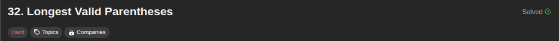
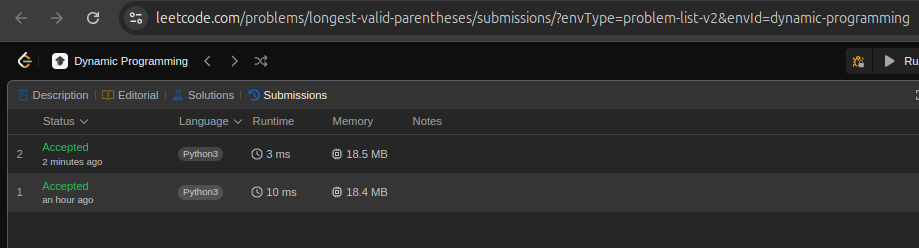

## 32. Longest Valid Parentheses

[Link para a questão](https://leetcode.com/problems/longest-valid-parentheses/description/)

### Gravação

[Link para a gravação](https://youtu.be/6mNtL-Jc5DQ)

#### Dificuldade: Difícil

### Enunciado

Given a string containing just the characters '(' and ')', return the length of the longest valid (well-formed) parentheses 
substring.

**Example 1:**

Input: s = "(()"
Output: 2
Explanation: The longest valid parentheses substring is "()".

**Example 2:**

Input: s = ")()())"
Output: 4
Explanation: The longest valid parentheses substring is "()()".

**Example 3:**

Input: s = ""
Output: 0

**Constraints:**

0 <= s.length <= 3 * 104
s[i] is '(', or ')'.

### Submissões: 

