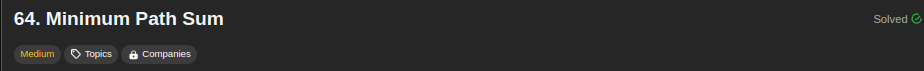
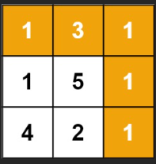
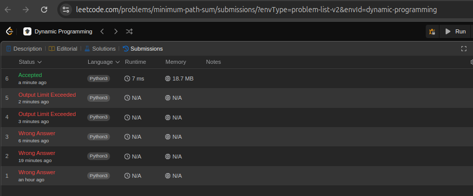
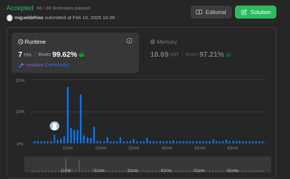

## 64. Minimum Path Sum

[Link para a questão](https://leetcode.com/problems/minimum-path-sum/description/)

### Gravação

[Link para a gravação](https://youtu.be/aidKLpYVggk)

#### Dificuldade: Média

### Enunciado

Given a m x n grid filled with non-negative numbers, find a path from top left to bottom right, which minimizes the sum of all numbers along its path.

Note: You can only move either down or right at any point in time.

**Example 1:**

Input: grid = [[1,3,1],[1,5,1],[4,2,1]]
Output: 7
Explanation: Because the path 1 → 3 → 1 → 1 → 1 minimizes the sum.

**Constraints:**

m == grid.length
n == grid[i].length
1 <= m, n <= 200
0 <= grid[i][j] <= 200

### Submissões: 

